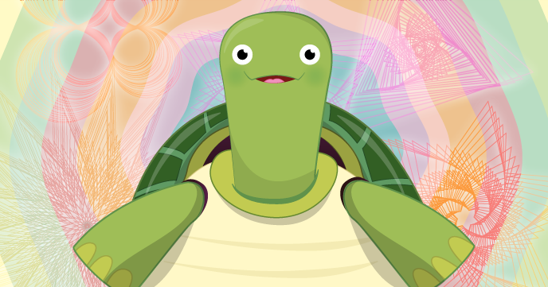

# Example Resource

In this resource you will take your first steps with the programming langauge Python to draw shapes, patterns and spirals. You will use a module named Turtle. Along the way you will learn how to think in sequences, and use loops to repeat a sequence. This is a great stepping stone from a visiual programming language like Scratch to the text based environment of Python. 

By making patterns with Python code you will learn:

- To take your first steps with the Python programming language
- How to draw lines with Python Turtle
- How to make turns
- How to change the pen colour
- To use loops to repeat some instructions and create shapes
- To use more loops to create spiral patterns

## Licence

Unless otherwise specified, everything in this repository is covered by the following licence:

***Example Resource*** by the [Raspberry Pi Foundation](http://www.raspberrypi.org) is licenced under a [Creative Commons Attribution 4.0 International License](http://creativecommons.org/licenses/by-sa/4.0/).

Based on a work at https://github.com/raspberrypilearning/example-resource
