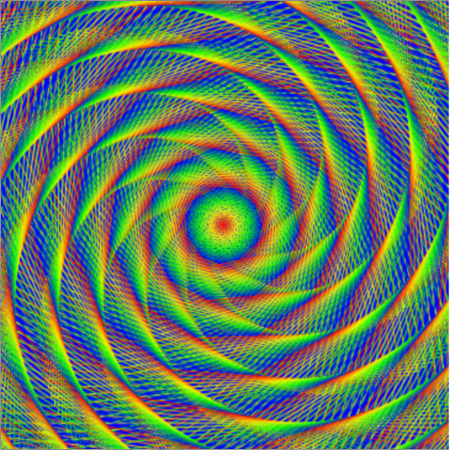

## Is it art, maths, or computer science?

Have a look at the image below. How would you describe it? Is is art, maths, or computer science? 

It's a computer-generated image, but making it requires an understanding of art, maths, and computer science. Let's see how you too can make images just like this.

## Drawing a line

The image above is made up of lines and only lines! To get started, you need to know how to draw a line using a little bit of Python code. 

  

    Click on the <strong>Run</strong> button to run the program. Change the number and see what happens 
    
  

  

    <iframe 
      src="https://editor.raspberrypi.org/en/embed/viewer/starter-turtley-amazing" 
      width="600" 
      height="600" 
      frameborder="0" 
      marginwidth="0" 
      marginheight="0" 
      allowfullscreen>
    </iframe>
  

Notes:

- Click on **Run**  to see the code working.
- Now try changing the number in the line `turtle.forward(100)`, click on **Run**  again and see what happens.

