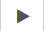

## Tracer une ligne

L'image ci-dessus est composée de lignes et uniquement de lignes! Pour commencer, tu dois savoir comment dessiner une ligne en utilisant un peu de code Python. Ci-dessous se trouve un environnement Python interactif appelé Trinket: tu peux y écrire du code, puis l'exécuter pour voir ce qui se passe. <iframe src="https://trinket.io/embed/python/0d2e8c2dac" width="100%" height="600" frameborder="0" marginwidth="0" marginheight="0" allowfullscreen></iframe> 

- Clique sur **Exécuter**  pour voir le code fonctionner.
- Maintenant, essaye de changer le nombre de la ligne `turtle.forward (100)`, clique à nouveau sur **Run**  et vois ce qui se passe.