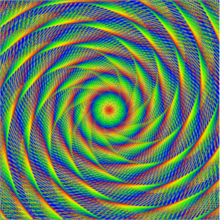

## यह कला है, गणित है, या कंप्यूटर विज्ञान है?

नीचे दी गई छवि पर एक नज़र डालें। आप इसका वर्णन कैसे करेंगे? यह कला है, गणित है, या कंप्यूटर विज्ञान है?

यह एक कंप्यूटर से उत्पन्न छवि है, लेकिन इसे बनाने के लिए कला, गणित, और कंप्यूटर विज्ञान की समझ होना आवश्यक है। आइए देखते हैं कि आप भी इस तरह छवियों को कैसे बना सकते हैं।