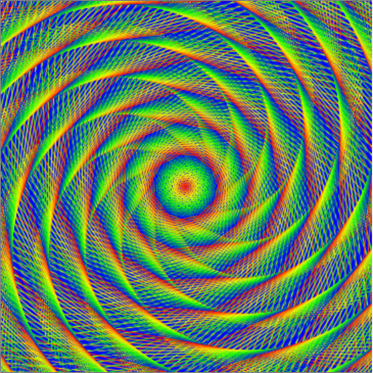

# Turtley Amazing

## Is it Art, Maths, or Computer Science?

Have a look at the image below. How would you describe it? Is is art, maths, or computer science? 



It's a computer generated image, but to make it requires an understanding of art, maths and computer science. Let's see how you too can make images just like this.

## Drawing a line

The image above is made up of lines and only lines! To get started, you need to know how to draw a line using a little bit of Python code. Below is an interactive Python environment: you can write code in it, and then run it to see what happens.

  <iframe src="https://trinket.io/embed/python/0d2e8c2dac" width="100%" height="600" frameborder="0" marginwidth="0" marginheight="0" allowfullscreen></iframe>

1. Click on **Run** to see the code working.
1. Now try changing the number in the line `turtle.forward(100)`, click on **Run** again and see what happens.

## Turning

You've used code to draw a line. Good work! Now let's try making the turtle turn around. To do this you need to instruct the turtle not only to move forward, but also to turn right or left. 

  <iframe src="https://trinket.io/embed/python/88c91b8dfb" width="100%" height="600" frameborder="0" marginwidth="0" marginheight="0" allowfullscreen></iframe>

1. What do you think will happen in the code above? Click on **Run** to see if you were right. 

  `turtle.right(90)` turns the cursor 90 degress right. You can also turn left with `turtle.left(90)`. To change the amount that the cursor turns, simply change the value of degrees. 

1. Complete the square shape you've started by adding the next lines of code and press **Run**. Keep trying until you get it right. 

### Challenge
Try to complete each of the challenges below.

1.  Draw a rectangle: two of the four sides need to be longer.
1.  Draw a triangle: how many degrees do you need to turn?
1.  Draw a cross: backwards and forwards work well together.
2.  Draw a circle: what happens if you turn lots? 

## Changing colours
The default colour for the pen used by the turtle cursor is black, and the default background colour is white. You can change the colours to make your shapes look even better.

1. Look at the code below. It contains three variables called `R`, `G`, and `B`.

  <iframe src="https://trinket.io/embed/python/b964b7d3ce" width="100%" height="600" frameborder="0" marginwidth="0" marginheight="0" allowfullscreen></iframe>

  Variables are a way of storing a value, and giving it a name. For instance there is a variable name `R` with a value of `255`. 

1. Run the code and see what happens. 
1. Try changing the values of the three variables, and see what happens. (Note: the maximum value is 255, and after this there will be no effect.) What do you think R, G and B represent?

  You can change the value of your variables either by setting them to a new value, or by increasing and decreasing them?

1.  You can change the colour of the turtle as well. Run the code below to see what happens:

  <iframe src="https://trinket.io/embed/python/ab6732d60e" width="100%" height="356" frameborder="0" marginwidth="0" marginheight="0" allowfullscreen></iframe>

### Challenge 
Try to complete each of the challenges below.

1.  Complete the triangle above with a colour of your choice
1.  Draw a square with sides which are four different different shades of red
1.  Draw a cross made of four different colours

## Repetition

Repeating lines of code is one of the fastest ways to get something done. Quite often in computer science, it makes more sense to repeat lines of code rather than write out another instructions. For example, the square you created earlier uses the same two instructions four times. Rather than writing them out four times, you could write them out once but add an instruction to repeat them.

In Python there are two types of loops that you are likely to want to use: A `while` loop and a `for` loop. 
- If you want a section of code to repeat forever, or until a condition is set, then a `while` loop might be best. 
- If you want to loop for a set number of times, then a `for` loop is preferable. 

1. Below I've used a `while True` loop. This means that the code inside the loop (or indented) will repeat forever. You can try it in trinket to see what it does, but remember it will loop **forever**!

  ```python
  from turtle import Turtle, Screen
    
  turtle = Turtle()
  
  while True:
      turtle.forward(1)
      turtle.right(1)
  ```

  This type of loop is not going to be very useful for drawing shapes with turtle where you want to be more precise. 

1. In this example, a `for` loop has been used. Press **Run** to see what happens.   
  
  <iframe src="https://trinket.io/embed/python/b89b6f5457" width="100%" height="356" frameborder="0" marginwidth="0" marginheight="0" allowfullscreen></iframe>

  A `for` loop repeats instructions a set number of times. In this case 8 times. A `for` loop has an associated variable (called `i` here). In this example `i` starts from `0` and increases by `1` each time. Let's apply this to the code to draw a square:

  ```python
  from turtle import Turtle, Screen
    
  turtle = Turtle()
  
  for i in range(4):
      turtle.forward(100)
      turtle.right(90)
  ```

1. Copy and paste this code into the trinket above and run it. The turtle has been asked to repeat two instructions 4 times to make a square.

1. Once you have created one shape using a loop, you can repeat the shape again and again by putting it inside another loop. This is a great way to draw spirals. Adapt your code, by making it look like this:

  ```python
  from turtle import Turtle, Screen
    
  turtle = Turtle()
  
  for i in range(30):
      for i in range(4):
          turtle.forward(100)
          turtle.right(90)
      turtle.right(25)
  ```
  A spiral can be made by turning a small degree and then moving forward a small amount. The section of code for making a square is inside another `for` loop that repeats it 30 times, each time turning the cursor 25 degress to make a pleasing spiral shape.  
  
### Challenge
*Try and complete each of the challenges below.*

1. Can you alter the `for` loop so that it draws a more interesting spiral using one of the shapes you made earlier, like a triangle or circle?

1. Adding a few extra lines where you alter the variables `R`, `G`, and `B`, would allow you to make a multicoloured spiral. Have a go at creating a rainbow spiral.

## What next?
- Become a python turtle expert by continuing with the [next page of Turtley Amazing](worksheet2.md)!
- Learn how to use `functions` to [draw snowflakes](https://www.raspberrypi.org/learning/turtle-snowflakes/) using turtle. 
- Create interactive stories using `lists` in Python with the [Storytime](https://www.raspberrypi.org/learning/storytime/) resource. 
- Take your first steps [controlling physical objects](https://www.raspberrypi.org/learning/getting-started-with-gpio-zero
) with Python and a Raspberry Pi. 
